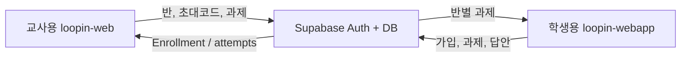

# 학생용 ↔ 교사용 동기화 (구현 상태)

> `loopin-webapp`(학생) + `loopin-project`/`loopin-web`(교사)  
> **공통 백엔드: Supabase PostgreSQL + Anonymous Auth + Realtime**

| 표기 | 의미 |
|------|------|
| **구현됨** | 코드·스키마에 반영됨 |
| **환경 필요** | `.env.local`에 Supabase URL·키가 있어야 동작 |
| **데모 유지(도달 불가)** | 코드·자산은 남아 있으나 초대코드 단계의 env 게이트 때문에 현재는 실제로 도달할 수 없음 |

---

## 1. 확정된 동작

- 초대코드 성공 시 **승인 없이** 즉시 `enrollments` 생성 (`enroll_with_invite_code` RPC)
- 학생은 여러 반 가입 가능 · 홈은 **가장 최근 가입 반**을 활성 반으로 사용
- 과제 `content_snapshot`으로 문항 원본 고정 · 학생 실행기는 snapshot 기반
- 시도(`attempts`)·답안(`answers`) 보존 · 교사는 **최신 시도** 상태 + 최초/최신 점수 표시
- Realtime 구독 실패 시 focus/재진입 시 재조회



---

## 2. 환경설정

학생 앱 `.env.local`:

```
VITE_SUPABASE_URL=https://xxxx.supabase.co
VITE_SUPABASE_ANON_KEY=sb_publishable_...
```

교사 앱 `.env.local`:

```
NEXT_PUBLIC_SUPABASE_URL=https://xxxx.supabase.co
NEXT_PUBLIC_SUPABASE_ANON_KEY=sb_publishable_...
```

스키마: 교사 저장소 `loopin-web/supabase/migrations/001_loopin_sync.sql`  
Authentication → **Allow anonymous sign-ins** ON 필요

**Loopin TTS (영·한):** 학생 앱은 PC 음성 설정 없이 앱 제공 TTS만 사용한다.  
Supabase Edge Function `loopin-tts` 배포 필요 (1회):

```bash
supabase functions deploy loopin-tts
```

- 영어: `en-US-AriaNeural` (여성)
- 한국어: `ko-KR-SunHiNeural` (여성)
- 데모 단어/예문은 `public/assets/audio/*.wav` 번들도 함께 사용

---

## 3. DTO (공유)

양 앱 `src/lib/sync/types.ts`:

- `StudentProfile`, `Enrollment`, `StudentAssignment`, `AttemptProgress`, `AnswerEvent`
- `ContentSnapshot` (단어/문장/문법 + problemTypes)

### 3.1 현재 데이터 한계

양 앱의 DTO 모양은 같지만, 모든 유형을 정확히 채점할 만큼 명시적이지는 않다.

- 유형은 enum이 아니라 한글 UI 문자열로 전달된다.
- 단어 라벨은 **A 짝맞추기 · B TTS 뜻 짝맞추기 · C 3지선다 · D 예문 빈칸** (구 B/C는 각각 C/D). B는 교사 라벨 `TTS 뜻 짝맞추기` → `WordListenMatchScreen`.
- 단어 C(3지선다)의 오답 선택지는 학생 앱이 다른 선택 단어에서 만든다.
- 단어 D(예문 빈칸)는 `[표면형]`을 정답으로 해석한다. 대괄호가 없으면 생성하지 않는다.
- 문법 선택형은 명시적 `correctAnswer`가 없다. 유효한 교체 대상과 선택지가
  있는 행만 사용하며, 현재 데이터 규약의 첫 선택지를 정답으로 해석한다.
- OX문제에서 `ox=X`이고 `wrongPart`+`choices`(3개+)가 있으면 OX 다음에
  빨간 밑줄 교정 3지선다를 붙인다. O이거나 교정 데이터가 불완전하면 OX만 진행한다.
- `choices: "-"`, 빈 choices, 잘못된 O/X 값은 문항에서 제외한다.
- 문제은행에는 `What he need is money.`를 O로 표시한 사례처럼 원본 검수가
  필요한 행이 있다. 학생 앱은 교사의 `ox` 값을 전달받은 그대로 표시하므로
  문제은행 정정이 필요하다.
- 문제 세트를 수정해 재게시하면 기존 `content_snapshot`도 덮어쓸 수 있어,
  현재 구현은 완전한 불변 스냅샷이 아니다.

---

## 4. 학생 앱 구현 맵

| 기능 | 위치 | 상태 |
|------|------|------|
| 익명 세션·프로필 | `src/lib/sync/student-api.ts` + 온보딩 | 구현됨 |
| 초대코드 가입 | `MainHomeScreen` → `enrollWithInviteCode` | 구현됨 |
| 과제 목록 | `fetchStudentAssignments` → `AssignmentReceivedScreen` | 구현됨 |
| 과제 실행 | `AssignmentRunnerScreen` → `build-session-sections` → 기존 Figma `*Screen` | 구현됨 |
| 데모 고정 세션 | 기존 word-match 등 | 코드·자산은 남아 있으나 초대코드 단계가 env 없이는 통과되지 않아 현재는 이 경로로 도달 불가 (`MainHomeScreen.tryEnter`가 `isSyncEnabled()===false`면 에러만 표시) |

---

## 5. 교사 앱 구현 맵

| 기능 | 위치 | 상태 |
|------|------|------|
| 영구 초대코드 | `TeacherClass.inviteCode` | 구현됨 |
| 반/과제 원격 게시 | `src/lib/sync/teacher-sync.ts` | 구현됨 |
| Enrollment 병합 | `TeacherFigmaFrame` + Realtime | 구현됨 |
| 과제/학생 진도 UI | `ClassAssignmentsPanel`, `ClassStudentsPanel` | 구현됨 |

---

## 6. 검증 시나리오

1. 교사: 반 생성 → 홈에서 초대코드 복사  
2. 학생: 온보딩(이름) → 초대코드 입력 → 맵 진입  
3. 교사: 학생 탭에 즉시 반영 확인  
4. 교사: 문제 세트 제출·반 부여  
5. 학생: 성 클릭 → 풀이 → 진행률 갱신 · 새로고침 재개  
6. 교사: 과제 탭에서 완료/점수 확인  
7. 잘못된 코드 / 중복 가입 메시지 확인  
