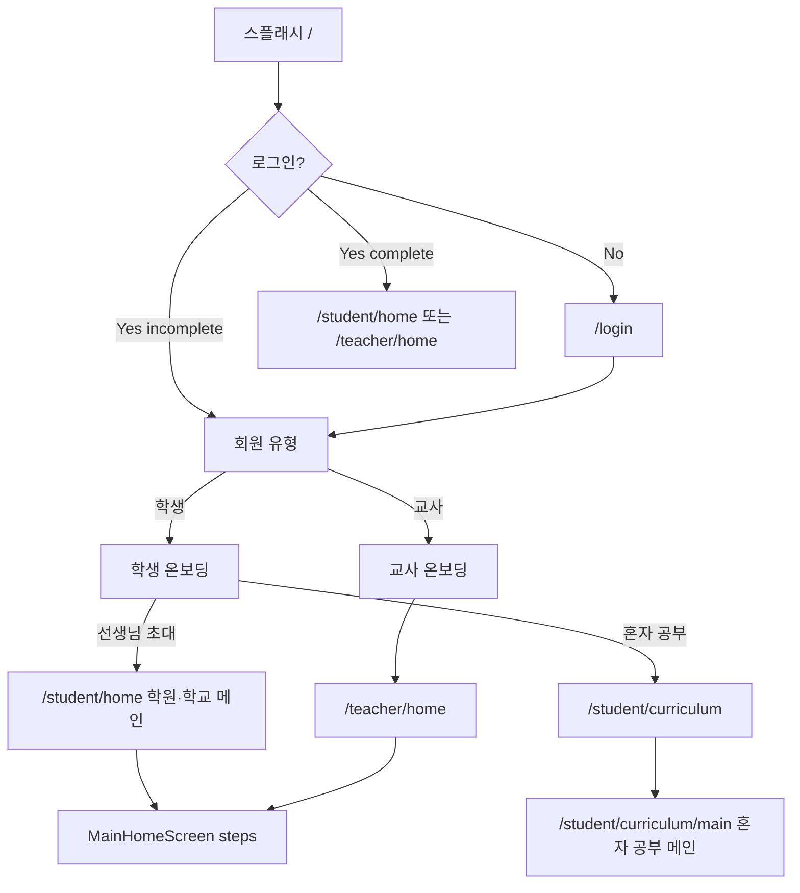
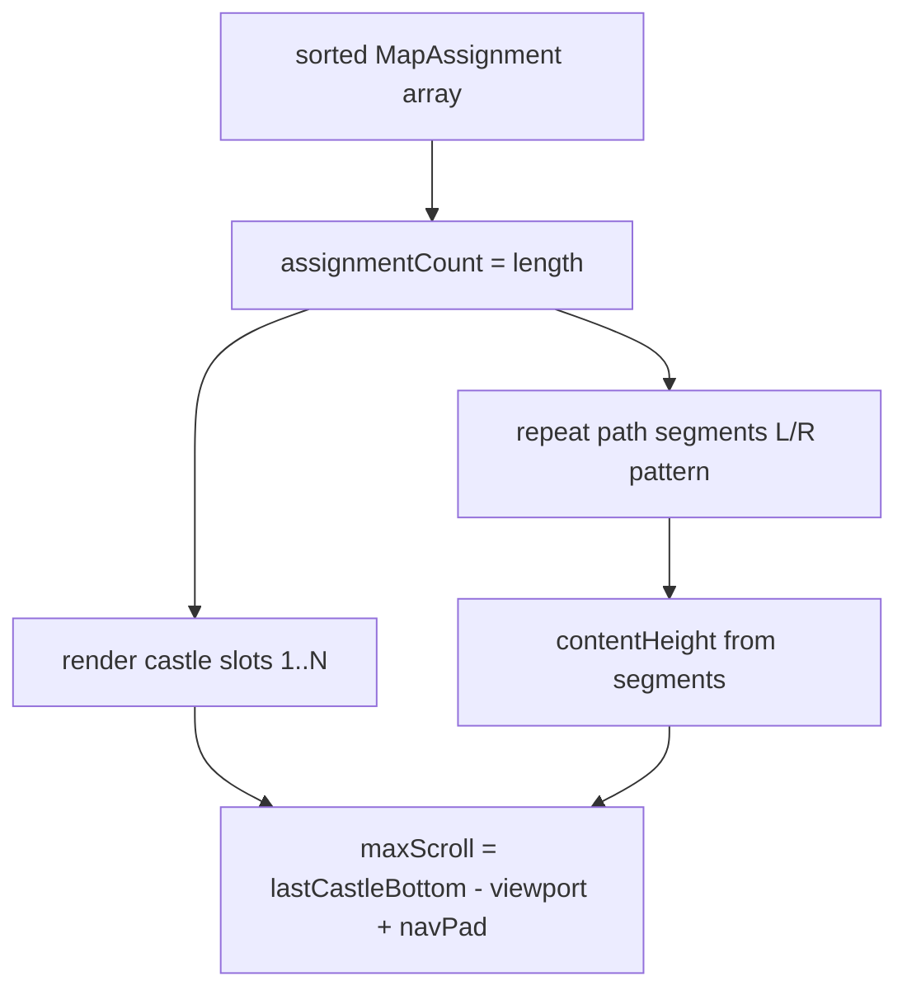

# UI/UX

> 학생용 웹앱(`loopin-webapp`)의 사용자 플로우·인터랙션·상태 정의.  
> **현재 구현**과 **목표**를 구분한다.

---

## 1. 제품 원칙

| 원칙 | 설명 |
|------|------|
| 모바일 우선 | 디자인 기준 프레임 **393×852** 비율 유지, 앱 셸 max-width 540px |
| Figma 충실 | 시안 픽셀 단위 구현, 임의 UI 변경 금지 |
| 터치 중심 | 주요 CTA·선택지는 투명 히트 영역 오버레이 |
| 일관된 뒤로가기 | 진행 화면 좌상단에 공통 `<` 버튼, 실제 직전 앱 상태로 복귀 |
| 즉각 피드백 | 정답/오답 SFX, 테두리 색, 완료 시트 |
| 학습 흐름 단절 최소화 | 세션은 URL이 아닌 내부 step으로 이어짐 |

---

## 2. 전체 플로우

### 학생 메인 2종 (에이전트 · 필수)

| 이름 | 라우트 | 컴포넌트 | 언제 |
|------|--------|----------|------|
| **학원/학교 메인** | `/student/home` | `MainHomeScreen` / `AssignmentReceivedScreen` | 선생님 초대 · 과제 성 맵 |
| **혼자 공부 메인** | `/student/curriculum/main` | `CurriculumMainScreen` | 내신 코스 생성 후 Day 맵 |

**`/student/main` 라우트는 존재하지 않는다.** 구어 “student/main” = `/student/home`.

### 2.1 인증·온보딩

| 단계 | 경로 | 동작 (현재) |
|------|------|-------------|
| 스플래시 | `/` | 1.8초 후 `localStorage` auth로 분기 |
| 로그인 | `/login` | Apple/카카오 목업 → 새 사용자 생성 (**기존 auth 초기화**) |
| 회원 유형 | `/onboarding/member-type` | 학생 / 교사 선택 |
| 학생 온보딩 | `/onboarding/student` | 약관 → 이름 → 생년월일 → 학년 → 학습목적 선택 |
| 교사 온보딩 | `/onboarding/teacher` | 약관 → 학교명 → 이름 → 완료 |

> 온보딩에서 입력한 이름·생년월일·학년·학교명은 **UI만** 수집하며, 완료 시 `onboardingCompleted: true`만 저장된다.

학생 온보딩 마지막 단계(`온보딩_학습목적선택`)는 "선생님 초대를 받았어요" /
"혼자 공부할래요" 2개 카드 중 하나를 고르는 화면이다. 카드를 탭하면 즉시
파란 테두리(`#46AFFF` + 은은한 그림자)가 표시되고, 별도의 "다음" 버튼 없이
약 300ms 후 온보딩이 완료된다(중복 탭 방지를 위해 첫 선택만 반영).

- **"선생님 초대를 받았어요"** → `navigate('/student/home', { state: { forceInviteStep: true } })`  
  → **학원/학교 메인** · 초대코드 입력부터
- **"혼자 공부할래요"** → `navigate('/student/curriculum')`  
  → 내신 코스 만들기 → 생성 후 **`/student/curriculum/main`** (혼자 공부 메인)

### 2.2 학원/학교 메인 (`MainHomeScreen` · `/student/home`)

| Step | UI | 다음 |
|------|-----|------|
| `invite` | 초대코드 입력 | env(`VITE_SUPABASE_*`) 없으면 에러 표시 후 대기, 있으면 `enrollWithInviteCode` RPC 성공 시 `assignment`로 직행 (`TEST` 하드코드·`waiting` 3초 대기 없음 — 아래 참고) |
| `waiting` | (현재 진입 경로 없음) | step·화면은 코드에 남아 있으나 `goToStep('waiting')` 호출부가 없어 도달 불가 |
| `assignment` | 성 맵 | env 있으면 서버 과제 → `assignment-runner`; 없으면(데모, 현재 도달 불가) 1회차 성 → `word-match` / 2회차 성 → `learning-1` |
| `word-match` → `word-quiz` → `word-spell` | 단어 학습 | `learning-complete` |
| `learning-complete` | 단어 구간 완료 | `body-text-a` |
| `body-text-a` → `b` → `c` | 본문 | `body-text-complete` |
| `body-text-complete` | 본문 완료 | `grammar-type-1` |
| `grammar-type-1` → `grammar-type-2` | 문법 | `grammar-complete` |
| `grammar-complete` | 결과·재시도 | 홈 또는 재시도 |
| `learning-1` → `2` → `3` → `4` | 2회차 성 학습 | 맵으로 복귀 |

> 맵 캐릭터: **시작 깃발 루핀은 유지**, 성/브릿지 환호 루핀·잔상은 **제거**. 상세는 [main-home.md](./screens/main-home.md).

### 2.3 혼자 공부 · 커리큘럼 메인 맵 (`/student/curriculum/main`)

| 상태 | UI |
|------|-----|
| 미시작 (진도 0%) | 시작점 `커리큘럼시작캐릭터` + Day **1·2·3** 빨간 활성 버튼 |
| 1주차 활성 | Day 1·2·3 항상 해금(`#FD3D3D`). 탭 → 완료(학습 세션 연동 전 스텁) |
| 2주차 해금 | **1·2·3 모두 완료** 시 Day 4·5·6 빨강 활성 · 해당 자물쇠 뱃지 가림 |
| 3주차 해금 | **4·5·6 모두 완료** 시 Day 7·8·9 빨강 활성 · 해당 자물쇠 뱃지 가림 |
| 4주차 해금 | **7·8·9 모두 완료** 시 Day 10·11·12 빨강 활성 · 해당 자물쇠 뱃지 가림 |
| 5주차 해금 | **10·11·12 모두 완료** 시 Day 13·14·15 빨강 활성 · 해당 자물쇠 뱃지 가림 |
| 잠금 Day | LONG 베이크 — 회색 원 + React 자물쇠(원 위). 4·5주 베이크 자물쇠는 `opacity=0` 후 React로 통일 |
| 진행 중 Day | 다음 해금·미완료 Day **원 위**에 러닝 캐릭터(버튼보다 앞 레이어). **홀수 주 우향 · 짝수 주(2·4) 좌향**. 주차 라벨은 캐릭터 머리 위(겹침 없음). 노드 번호는 길 방향 유지(2주 화면상 `6·5·4`) |
| 스크롤 | 하늘(타이틀·코스 칩·미션 카드) 고정 · LONG 맵만 세로 스크롤 · 하단 내비 81px 고정 |
| 하단 내비 | 바 **전체** 탭 → `SettingsWindow`(`설정 창` 에셋). 닫기: 좌상단 히트 · 공통 `<` 뒤로가기 |

> Day 해금 UI는 `CurriculumDayNodes`. 숫자 크기는 잠금 노드 path와 동일.  
> **이 화면 ≠ `/student/home`.** 학원/학교 성 맵 작업과 섞지 말 것.

### 2.4 혼자 공부 · 내신 코스 만들기 (`/student/curriculum`)

| 필드 | 인터랙션 |
|------|----------|
| 학년 | 단일 드롭다운 (중1·중2·중3) |
| 교재 | 단일 드롭다운 (교과서 10종) |
| 단원 | **1~8단원 버튼** (`1단원`…`8단원`). **최대 2개**까지 다중 선택. 칩에 `1,3단원`처럼 요약. 1개 이상 선택해야 생성 가능 |
| CTA | 「특별 내신 코스 생성하기」 → `/student/curriculum/main` |

---

## 3. 인터랙션 패턴

### 3.1 공통

| 패턴 | 동작 |
|------|------|
| Figma 프레임 + 오버레이 | SVG/이미지 위에 투명 `button`/`input` |
| Primary CTA | 하단 고정 버튼 영역 (확인·다음·입장하기) |
| 하단 내비 → 설정 | **홈** → 해당 메인 · **전체** → `SettingsWindow`. 설정 UI·하단 바는 **개인 커리큘럼 기준**(`CurriculumBottomNav`). 맵에서는 **홈** 검정 활성, 설정에서는 **전체** 검정 활성(홈은 회색). 설정 프로필 **이름**=온보딩 입력, **연동**=로그인 provider(`kakao`/`apple`/`google`) |
| 뒤로가기 | 좌상단 44×44px `<` 버튼, safe-area 반영, 최상위 레이어. 설정 창이 열려 있으면 먼저 설정만 닫음 |
| Enter 키 | 일부 입력·연습에서 계속하기 (`use-enter-to-continue`) |
| 탭 사운드 | `playTapSfx` / 정오답 `playAnswerSfx` |
| 컨테이너 클리핑 | 긴 문장·빈칸·배경 마스크가 **카드/프레임 밖으로 튀어나오면 안 됨**. 내용이 넘치면 카드 bounds 안에서 줄바꿈·`overflow: hidden`으로 처리 |

### 3.2 공통 뒤로가기

`AppFrame`이 공통 버튼을 한 번 렌더하고, 현재 화면이
`useBackNavigation`으로 실제 복귀 동작을 등록한다.

| 현재 화면 | 뒤로가기 동작 |
|-----------|---------------|
| 회원 유형 | 로그인 |
| 학생/교사 온보딩 2단계 이상 | 직전 온보딩 단계 (입력값 유지) |
| 온보딩 1단계 | 회원 유형 선택으로 복귀, 임시 회원 유형 초기화 |
| 초대코드 입력 후 대기 | 초대코드 입력 |
| 과제 맵 | 해당 맵에 진입하기 전 앱 상태 |
| 단어·본문·문법·성 학습 | 실제로 지나온 직전 학습 화면 |
| 오답 재시도 | 고정 단계표가 아니라 재시도 진입 이력을 따라 복귀 |

버튼을 표시하지 않는 루트:

- 스플래시 `/` — 자동 분기 화면
- 로그인 `/login` — 앱 내부 상위 화면 없음
- 메인 홈의 최초 초대코드 입력 — 현재 홈 흐름의 루트

뒤로갈 때 영어/한국어 재생을 즉시 중지한다. 화면 전환 대기 타이머도
언마운트 시 해제하여 이전 화면의 완료 콜백이 뒤늦게 실행되지 않게 한다.

> 브라우저 자체 Back 버튼과 앱 `<` 버튼의 완전한 동기화는 미구현이다.
> 현재 명세는 화면 안의 공통 버튼을 기준으로 한다.

### 3.3 퀴즈·선택

| 상태 | UI |
|------|-----|
| idle | 중립 테두리 (회색) |
| selected | 파란 테두리 (`#3B6FF5`) — **선택 후에만** |
| correct | 초록 테두리 |
| wrong | 빨간 테두리 → 잠시 후 선택 해제(재시도형) |

> 정답이 SVG에 미리 하이라이트되어 있으면 안 된다 (`castle-learning` 학습2/4).

### 3.3.1 문법 OX → X 교정

| 단계 | 동작 |
|------|------|
| OX | `grammar-type-2.svg` — 문장이 맞으면 O, 틀리면 X |
| 정답 O | 피드백 후 **다음 OX(또는 다음 유형)** 로 진행. 교정 스텝 없음 |
| 정답 X | 피드백 후 `grammar-type-2-x.svg` — 틀린 부분을 **빨간 글자 + 밑줄**로 표시하고 **3지선다**로 고침 |
| 데이터 | 교사 스냅샷 `ox=X` + `wrongPart` + `choices` 3개 이상일 때만 교정 스텝 생성 |

### 3.4 오답 재시도

문법 완료 화면에서:

1. **전체 다시 풀기** — 세션 결과 초기화 후 `word-match`부터
2. **오답만 풀기** — 오답 섹션만 순서대로, 진행바 숨김
3. **홈으로** — 1회차 완료 표시 후 맵

오답만 풀기 중 마지막 섹션이면 홈으로 바로 복귀할 수 있다.

### 3.5 TTS / 오디오

| 용도 | 방식 |
|------|------|
| 영어·한국어 | **Loopin 제공 TTS** — 번들 wav(데모) + Supabase `loopin-tts` Edge Function(Aria/SunHi Neural). PC 음성 설정 불필요 |
| 단어 B · TTS 뜻 짝맞추기 | 왼쪽 오디오 타일 탭 → 영어 발음 재생 후, 오른쪽 한글 뜻과 짝 맞춤 (A와 동일 매칭 UX, 글자 대신 듣기) |
| 화면 이탈 | `stopLoopinTts` / `stopEnglishWordAudio` / `stopKoreanSpeech` |

### 3.6 선생님 과제의 문제 유형

동기화 과제도 **범용 카드 UI를 쓰지 않는다.**  
`AssignmentRunnerScreen`은 유형 순서만 제어하고, 실제 문항은 기존·신규 Figma Export
화면(`WordMatchScreen`, `WordListenMatchScreen`(목표), `WordQuizScreen`, `WordSpellScreen`, `BodyTextA/B/CScreen`,
`GrammarType1/2Screen`)에 동적 props로 넘긴다. 변환은
`build-session-sections.ts`가 담당한다.

#### 단어 유형 A~D (확정 라벨)

단어는 **4유형**으로 진행한다. 구(舊) B·C 라벨은 아래처럼 한 칸씩 밀린다.

| 라벨 | 이름 | 학생 화면 | 구현 |
|------|------|-----------|------|
| **A** | 짝맞추기 (영문 ↔ 한글 뜻) | `WordMatchScreen` · `word-a-*.svg` | **구현됨** |
| **B** | TTS 뜻 짝맞추기 (듣기 ↔ 한글 뜻) | `WordListenMatchScreen` · `word-a-start.svg` 재사용(전용 Export 전) | **구현됨** — A와 동일 매칭 UX, 왼쪽 스피커+파형 타일(탭 시 TTS). 전용 `word-b` Export는 추후 |
| **C** | 3지선다 | `WordQuizScreen` · (구 word-b → **word-c** 에셋으로 재매핑 예정) | **구현됨** (구 라벨 B) |
| **D** | 예문 빈칸 | `WordSpellScreen` · (구 word-c → **word-d** 에셋으로 재매핑 예정) | **구현됨** (구 라벨 C) |

> **마이그레이션:** 예전 문서/코드의 「단어 B = 3지선다」「단어 C = 예문 빈칸」은 각각 **C / D**로 읽는다.  
> 세션 순서: `word-match`(A) → `word-listen-match`(B) → `word-quiz`(C) → `word-spell`(D).

선생님 앱의 한글 유형 라벨을 임의 추정하지 않고 아래 값만 1:1로 해석한다.

| 선생님 유형 | 학생 화면 (Export) | 데이터 규칙 |
|-------------|---------------------|-------------|
| 짝맞추기 (단어 유형 A) | `word-a-*.svg` · `WordMatchScreen` | 4쌍씩 페이지 분할, 정답 시 영어 TTS. 한 페이지가 4짝 미만이면 **출제된 단어(`fillPool`)에서만** 랜덤 보충 — 데모 단어 폴백 없음. SVG 데모 타일은 흰 커버로 가림. 다음 페이지: ① 틀렸던 짝 우선 ② 나머지 랜덤 |
| TTS 뜻 짝맞추기 (단어 유형 B) | `word-a-start.svg` 재사용 · `WordListenMatchScreen` | A와 동일 페어·페이지 규칙. 왼쪽 타일은 영문 대신 **오디오(스피커+파형)** — 탭 시 해당 단어 TTS. 오른쪽은 한글 뜻. 안내: 「의미가 일치하는 것을 고르세요」. 교사 라벨: `TTS 뜻 짝맞추기` |
| 3지선다 (단어 유형 C) | `word-c-*.svg` · `WordQuizScreen` | 다른 단어 뜻으로 오답지 구성, 3개 미만이면 제외. *(구 라벨 B)* |
| 예문 빈칸 (단어 유형 D) | `word-d-*.svg` · `WordSpellScreen` | `exampleEn`에 `[표면형]`이 있을 때만 생성. 정답 띄어쓰기 유지. 첫 글자 슬롯 고정(힌트). 긴 정답은 본문 카드 밖으로 튀어나오면 안 됨. *(구 라벨 C)* |
| 번역 배열 (본문 A) | `body-text-a.svg` · `BodyTextAScreen` | chunksKo 또는 한국어 단어 분할. **틀린 조각 ≤2개**면 재도전 1회(카드 수정 가능, 루핀: 「음...순서가 살짝 꼬였어. 카드를 다시 눌러서 고쳐봐!」). 재도전 실패·완전 오답(>2)이면 「정답은 ○○야 다음에 잘할수있어!」. 정·오답 후 **제출하기 자리의 「계속하기」 버튼**(`ExerciseContinueButton`, 팝업 시트 없음) |
| 청크배열 (본문 B) | `body-text-a.svg`(재사용) · `BodyTextBScreen` | chunksEn 또는 영어 단어 분할. 청크는 **전부 소문자·마침표 제거**(힌트 방지). **제시문이 한글**이므로 스피커 UI 없음. 본문 A와 동일 **≤2 재도전 1회** / 실패 시 정답(`exampleEn`) 안내. 최종 정·오답 시 영어 정답 예문 TTS. 정·오답 후 **제출하기 자리 「계속하기」 버튼** |
| 영작 (본문 C) | `body-text-c.svg` · `BodyTextCScreen` | 상단: 한국어 뜻. 입력 박스: 단어 첫 글자는 **회색 음영 힌트**, 나머지 `_` — 알파벳 전체를 순서대로 입력(힌트 글자도 덮어쓰기 가능). 공백·문장부호는 자동. 글자·단어 간격 2배. 채점 시 입력+자동 공백·부호로 문장 복원 후 정규화 비교. **오답 시 재도전 1회**: 맞은 글자는 초록 음영으로 잠그고 틀린 칸만 다시 입력(안내: 「아쉽다! 맞은 글자는 남겨둘게. 틀린 곳만 다시 써봐!」). 재도전 실패 시 예문 안내 + **제출하기 자리 「계속하기」 버튼** |
| OX문제 (문법 유형 2) | `grammar-type-2.svg` · `GrammarType2Screen` | 유효한 `ox`(`O`/`X`)만 생성. **정답 O** → OX 후 다음 문항. **정답 X** → OX 후 `wrongPart`를 빨간 밑줄로 표시하고 `choices` 3지선다 교정(`grammar-type-2-x.svg`). `wrongPart`/`choices` 불완전하면 OX만 진행 |
| 선택형 문제 | `grammar-type-1.svg` / `grammar-type-2-x.svg` | `wrongPart`+선택지 2개→유형1, 3개+→유형2 단어선택(틀린 부분 빨간 밑줄). 불완전하면 제외 |

유형을 선택하지 않은 카테고리에 학생 앱이 임의 기본 유형을 붙이지 않는다.
잘못된 문제를 보여주는 것보다 생성하지 않는 것을 우선한다. 문항 완료 시
`recordAnswer` / 전체 완료 시 `completeAttempt`로 Supabase 진도를 보존한다.

---

## 4. 맵·성 상태

### 4.1 현재 구현 (목업)

| 성 | 현재 (목업) | UX |
|----|-------------|-----|
| 1회차 | 과제 부여, 완료 시 성 색 별표 + (현재 위치면) 성 안 루핀 | 클릭 → 단어·본문·문법 세션 |
| 2회차 (노란 성) | 과제 부여, 완료 시 성 색 별표 + (현재 위치면) 성 안 루핀 | 클릭 → 학습1~4 |
| 3·4회차 등 | 미부여 → 맵에 자물쇠 | 클릭 불가 (히트 영역 없음) |

`main-home-full-map.svg`로 **1·2성**까지 고정 표시하고, 3성부터는
`main-home-map-segment.svg`(LONG 시안 반복 구간)를 과제/무료 성 수만큼
이어 붙인다(`resolveMapScrollContentHeight` / `resolveMapSegmentCount`).
성 8색 재도색·슬롯 오버레이는 아직 적용하지 않음(배경만).

### 4.2 목표 UX — 동적 성 맵

> **구현 전 명세.** 고정 2944px SVG를 반복 구간 + 성 슬롯으로 대체한다.
> 시각 구조는 [design.md](./design.md), 렌더 계산은 [screens/main-home.md](./screens/main-home.md),
> 교사 연동은 [student-teacher-sync.md](./student-teacher-sync.md).

| 규칙 | 동작 |
|------|------|
| 성 생성 | **과제 1개 = 성 1개**. 정렬된 과제 배열 길이만큼만 성을 렌더 |
| 길·배경 | 짧은 배경·길 구간을 **좌/우 교대 패턴**으로 이어 붙임 |
| 맵 끝 | 마지막 부여 성 아래에는 **다음 구간을 렌더하지 않음** (무한 스크롤 없음) |
| 스크롤 경계 | 드래그 상한 = **부여 성 + 2개**(룩어헤드) 밑변이 보이도록. 그 이상 미부여 구간은 스크롤 불가 |
| 진입 포커스 | **「현재 위치」가 스크롤 뷰포트 세로 중앙** (완료 성 없으면 시작 깃발·필 기준) |
| 미완료 성 | 활성(컬러) 표시, **클릭 가능** |
| 완료 성 | 성 색과 동일한 별표 뱃지(`MissionCheckBadge`), **재진입 클릭 가능** → `castle-retry-screen.svg` 풀프레임 확인(하늘 무시). 재도전 중이면 별표를 **숨기고** 같은 자리에 코랄 「재도전 중!」 필(`CastleRetryingPill`). 재도전 끝나면 별표 복귀. **「현재 위치」는 바꾸지 않음** |
| 미부여 성 | 생성하지 않음 (회색 성 더미를 미리 깔아두지 않음) |
| 현재 위치 | **완료한 과제 중 `order`가 가장 큰 성**. 그 성 안에 만세 루핀(`만세 캐릭터.svg` → `mascot-banzai.svg` / `CastleCompleteMascot`, 하단 clip으로 성 벽에 가린 듯) + 성 아래 「현재 위치」 필(**72×28 / 13px Bold**, `#4F91EB`). 시작점 `MapCharacter`(`mascot-wave.png`)는 숨김. SVG 시작 「현재 위치」는 `display="none"`(잔디 덮개 네모 금지). 완료 성이 없으면 시작 깃발+대기 캐릭터 유지. **과거 성 재도전 시에도 이 위치는 유지** |

### 4.3 칭찬 캘린더

홈 맵의 기존 `이번 할 일` 표시는 **`칭찬 캘린더` 버튼**으로 교체한다.

| 항목 | 동작 |
|------|------|
| 위치 | 맵 상단 우측 · **뷰포트 고정** (`PRAISE_CALENDAR_FIXED_RECT`) — 맵 드래그/스크롤에 움직이지 않음 |
| 맵 잔상 | 풀맵 에셋에서 베이크 버튼 픽셀 제거 (잔디색 React 커버 사용 금지 — 스크롤 시 잔상) |
| 상태 | 활성 버튼, 44px 이상의 터치 영역 |
| 클릭 | `praise-calendar` 내부 화면으로 이동 |
| 뒤로가기 | 공통 좌상단 `<` 버튼으로 직전 홈 맵 복귀 |
| 기본 월 | **오늘**이 속한 달 (진입 시 **2026년 7월**~오늘 구간이 있으면 빠르게 넘김) |
| 월 범위 | **하한** = **2026년 7월**(제품 원점)과 앱 시작 달(최초 반 가입 `enrolledAt` · 없으면 가장 이른 `lessonDate`) 중 더 늦은 달. **상한 없음** — 이후 달로 계속 이동 가능. 원점보다 이전으로는 이동 불가 |
| 날짜 매핑 | 과제 `lessonDate` — `serverAssignments` 전달 |
| 이모티콘 | 완료·`latestScore` ≥70 → 통과 / 완료·&lt;70 → 아쉬움 / **마감(`lessonDate`+`deadlineTime`) 이후** 미제출 → 미제출. **마감 전** 미풀이 → 이모티콘 없음 |
| Export | `praise-calendar.svg` 베이스 + 달성·달력 그리드 React 오버레이 (`praise-status-*.png`) |
| 미리보기 (초대코드·대기 화면) | 기존 `이번 할 일` 자리(우측 끝 x=376)에 121×40 크기의 **딤 처리 비활성 버튼**으로 표시 (20px 라벨). SVG에 구워진 `이번 할 일` 레이어는 숨김 처리 |

과제 추가 시 맵이 아래로 한 구간 늘어나고, 과제 회수 시 해당 성·이후 구간이
사라지며 스크롤 상한도 다시 계산한다. 상세 상태 전이·API는 동기화 문서 참고.

### 4.4 반·과제 드롭다운

맵 상단 중앙의 흰 알약(`A반 3회차` 형태) + 파란 쉐브론. 선생님 웹에서 지정한
**반 이름**(`classes.name`)과 **과제 제목**(`assignments.title`)을 그대로 표시한다.

| 항목 | 동작 |
|------|------|
| 컴포넌트 | `SessionRoundDropdown` |
| 데이터 | `fetchMyEnrollments` → 반명 / `fetchStudentAssignments` → 과제 목록 |
| 선택 | 목록에서 과제 고르면 필 라벨만 바뀜 (맵 포커스 연동 없음) |

### 4.5 오늘의 미션 카드

홈 맵 상단의 `1회차 · 오늘의 미션` 자리는 `칭찬 캘린더`(4.3)와 같은 방식으로
처리한다 — SVG에 구워진 자리를 흰 카드로 덮고 실제 데이터로 교체한다. 카드 디자인은
Figma export `current-learning-cta-card.svg`(392×156)를 그대로 따른다.

| 항목 | 동작 |
|------|------|
| 위치 | 기존 미션 카드 자리 (반·과제 필 바로 아래) |
| 과제 선택 | 배정 과제 중 **미완료(`completed` 아님) & `order` 오름차순 최우선** 1건만 표시 |
| 배지 (좌상단 파란 필) | `progressPercent === 0` → **오늘의 미션** / 그 외 → **현재 학습 중** |
| 제목 | 선택된 과제의 실제 제목(`assignment.title`, 선생님이 지정한 문제 세트 이름) |
| 부제 | `약 n분 소요`만 표시(「n문제 남음」 없음). 문제당 10초 계산 후 분 단위 반올림 |
| 진행률 바 | 트랙 `#D9E3F7` · 채움 `#4F91EB`, 폭 = `progressPercent` + 우측 `%` 라벨 |
| 버튼 (우측 사각 CTA) | `progressPercent === 0` → **시작하기 →** / 그 외 → **이어서 학습하기 →** |
| 클릭 | 기존 성 클릭과 동일한 진입 경로(`assignment-runner`) — 이미 답한 문제는 서버 기준으로 자동 건너뛰고 이어서 보여준다 (별도 재개 인덱스 없음) |
| 빈 상태 | 배정 과제 없음 / 전부 완료 → 카드는 유지하되 배지·버튼 없이 안내 문구만 표시 |

---

## 5. 접근성

| 항목 | 현재 |
|------|------|
| 버튼 `aria-label` | 투명 히트 영역에 라벨 부여 |
| 뒤로가기 | `aria-label="뒤로가기"`, 44×44px 터치 영역, 키보드 활성화 |
| 키보드 | 일부 Enter 지원, 전체 키보드 내비는 미완성 |
| 포커스 링 | SVG 오버레이 특성상 약한 편 — TBD |
| 스크린 리더 | 이미지 프레임 `alt` + 컨트롤 라벨 |
| 모션/사운드 | SFX·TTS 끄기 UI 없음 — TBD |

---

## 6. 빈/오류/로딩 상태

| 상황 | 현재 동작 |
|------|-----------|
| 잘못된 초대코드 | 입장 불가 (에러 카피 없음) |
| 미로그인으로 홈 접근 | `/login` 리다이렉트 |
| 역할 불일치 홈 | 반대 역할 홈으로 리다이렉트 |
| 학습 중 새로고침 | **세션 결과·맵 완료 상태 소실** (인메모리) |
| 배정 과제 없음 / 전부 완료 | 오늘의 미션 카드에 안내 문구만 표시 (버튼 없음, 카드 자체는 유지) |
| 네트워크 | env 없으면 API 없음 — 해당 없음 · env 있으면 Supabase 요청 실패 시 대부분 조용히 무시(콘솔 경고)하고 빈 목록/에러 문구로 처리 |

---

## 7. 목표 UX (교사 연동 후)

> 아래 왼쪽 열은 **env(`VITE_SUPABASE_*`) 없을 때(현재)**, 오른쪽 열은 **env 있을 때** 동작이다.
> 오른쪽 열 대부분은 더 이상 "목표"가 아니라 env만 설정하면 이미 동작하는 현재 구현이며,
> 동적 맵 렌더링·교사 홈 리다이렉트만 실제로 미구현(진짜 목표) 상태다.

| env 없을 때(현재) | env 있을 때 |
|------|------|
| 초대코드 입력 시 즉시 에러, 진행 불가 (`TEST` 우회 없음) | 교사가 `loopin-project`에서 발급한 코드로 `enroll_with_invite_code` RPC 가입 — **구현됨** |
| (위와 같이 진행 불가하여 도달 안 함) | 서버에서 배정된 과제 목록 수신 (`fetchStudentAssignments`) — **구현됨** |
| 고정 2944px 맵·전 구간 스크롤 | 과제 수만큼 성·구간 생성, 마지막 부여 성까지 스크롤 — **미구현(진짜 목표)**, [design.md](./design.md) §1.1 |
| (위와 같이 진행 불가하여 도달 안 함) | 제출·진도를 Supabase `attempts`/`answers`에 저장, 교사 대시보드 반영 — **구현됨** |
| `/teacher/home` = 학생 UI | 교사는 `loopin-project`로 유도 또는 리다이렉트 — **미구현(진짜 목표)** |

상세: [student-teacher-sync.md](./student-teacher-sync.md)
